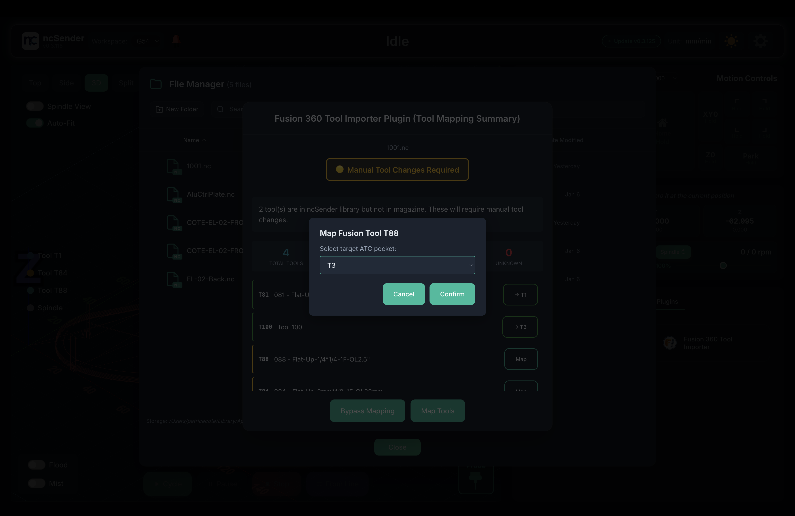

##**THIS CURRENTLY DOES NOT WORK WITH OFFICIAL BRANCH OF ncSender, WAITING FOR THE DEVELOPER TO INTEGRATE REQUIRED CHANGE**##

# Fusion 360 Tool Importer & Translator for ncSender

A comprehensive ncSender plugin that seamlessly imports tool libraries from Fusion 360 and automatically translates G-code tool numbers to match your ncSender ATC configuration.

## 🎯 Overview

Perfect for CNC users who design in Fusion 360 and run jobs with ncSender.

This plugin bridges the gap between Fusion 360 and ncSender by:

1. **Tool Library Import** - Import your complete Fusion 360 tool library (exported to JSON format) with one click
2. **G-Code Translation** - Automatically remap Fusion tool numbers to ncSender ATC pockets
3. **Interactive Tool Mapping** - Visual interface to manage and validate tool assignments

## ✨ Key Features

- **Smart Import**: See NEW, MODIFIED, and UNCHANGED tools before importing
- **Automatic Translation**: `T84 M6` in Fusion → `T6 M6` in ncSender (based on your mapping)
- **Visual Status**: 🟢 All ready / 🟡 Manual change needed / 🔴 Tools missing
- **One-Click Remapping**: Assign any tool to any ATC pocket directly from the dialog
- **Magazine Size Detection**: Respects your ncSender ATC configuration
- **Full Metadata**: Names, types, diameters, and all tool specifications preserved

*Tool import comparison*

*G-code translation status*

*Interactive tool mapping*

## 🚀 Installation

1. **Download** the latest release: [`com.ncsender.fusion360-import-v2.0.1.zip`](https://github.com/cotepat/ncsender-plugin-fusion360-tool-importer/releases/latest)
2. **Open ncSender** → Navigate to settings (gear icon), then **Plugins** tab
3. **Click** "Install Plugin" button
4. **Select** the downloaded zip file

The plugin will appear in **Plugins → Fusion 360 Tool Importer** menu.

## 📖 Quick Start

### Import Tool Library

1. Export your Fusion 360 tools as **JSON** (Tool Library → Export)
2. In ncSender: **Plugins → Fusion 360 Tool Importer**
3. Select the JSON file
4. Review the comparison table
5. Choose **Import New** or **Import All**

### Enable G-Code Translation

1. Go to Settings (gear icon), then **Plugins**
2. Find **Fusion 360 Tool Import**
3. Click **Settings** ⚙️
4. Enable **"Enable tool number mapping"**

### Load G-Code

1. Load any Fusion 360 G-code file
2. Plugin shows mapping status dialog
3. Map any unmapped tools if needed (click the tool button)
4. Click **Map Tools** to proceed or **Bypass Mapping** to skip

That's it! The dialogs guide you through the rest.

## ⚙️ Settings

### Tool Import Options
- **Include Fusion 360 tool number in description** - Adds `[XXX]` prefix for reference
- **Do not overwrite ncSender Tool Number** - Preserves existing ATC assignments

### Translation Options
Located in Plugins tab → Plugin settings:
- **Enable tool number translation** - Toggles automatic G-code translation on/off

## 🎨 Status Indicators

The plugin uses color-coded status:
- 🟢 **Green**: All tools mapped and ready for ATC
- 🟡 **Yellow**: Tools exist but need manual change (not in ATC)
- 🔴 **Red**: Tools not found in library (import required)

## 📊 Technical Details

### Tool Mapping Process
1. Parses all `M6`, `T##`, and `H##` commands in G-code
2. Loads tool library and mappings from ncSender
3. Shows status dialog with color-coded categorization
4. Translates commands if user confirms
5. Preserves original Fusion tool IDs in comments

### Compatibility
- **ncSender**: TBD
- **Fusion 360**: All recent versions (JSON export format)

---

**Version**: 2.0.1  
**Repository**: [github.com/cotepat/ncsender-plugin-fusion360-tool-importer](https://github.com/cotepat/ncsender-plugin-fusion360-tool-importer)
