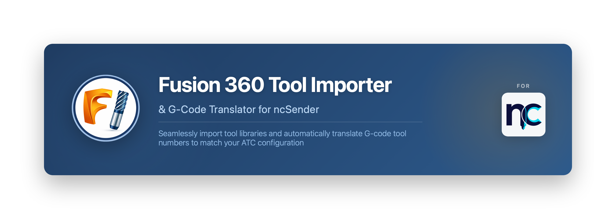
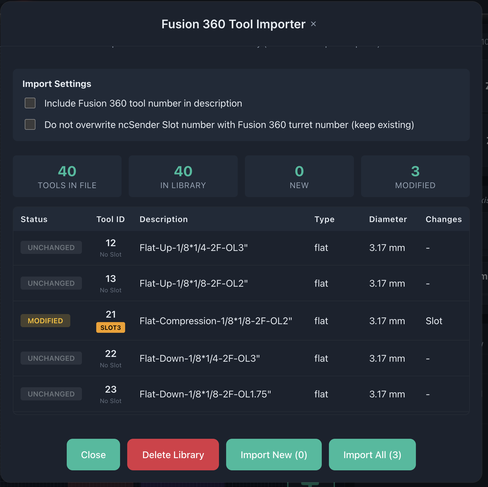
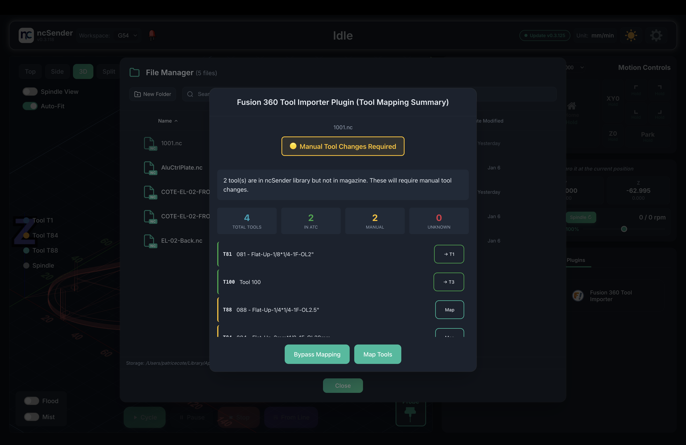
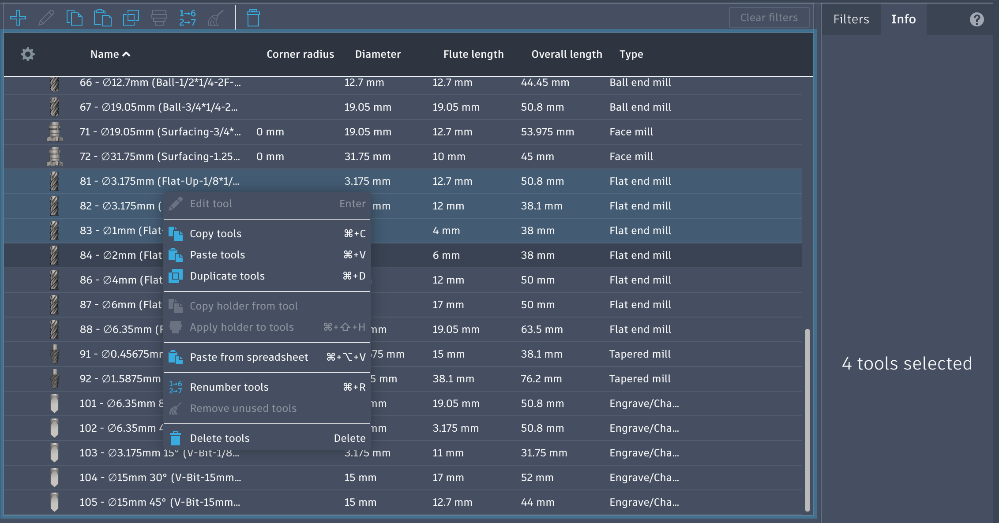
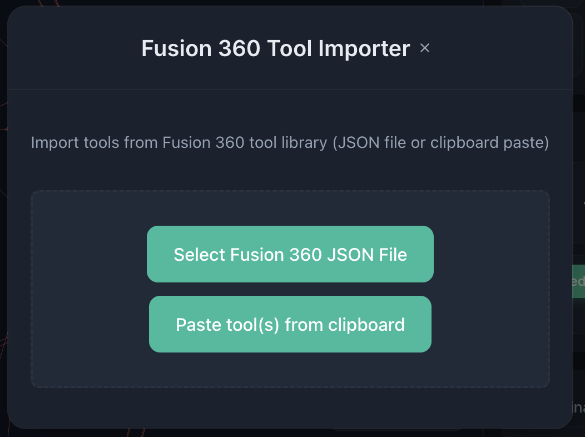

# Fusion 360 Tool Importer & Translator for ncSender

A comprehensive ncSender plugin that seamlessly imports tool libraries from Fusion 360 and automatically translates G-code tool numbers to match your ncSender ATC configuration.

## 🎯 Overview

Perfect for CNC users who design in Fusion 360 and run jobs with ncSender.

This plugin bridges the gap between Fusion 360 and ncSender by:

1. **Tool Library Import** - Import your complete Fusion 360 tool library (exported to JSON format) with one click
2. **G-Code Translation** - Automatically remap Fusion tool numbers to ncSender ATC pockets
3. **Interactive Tool Mapping** - Visual interface to manage and validate tool assignments

## ✨ Key Features

### Tool Import
- **Smart Import**: See NEW, MODIFIED, and UNCHANGED tools before importing
- **Clipboard Import**: Copy/paste tool data directly from Fusion 360 (TSV format)
- **File Import**: Import complete tool libraries from JSON exports
- **Full Metadata**: Names, types, diameters, offsets, and specifications preserved

### G-code Translation
- **Automatic Remapping**: `T84 M6` in Fusion → `T6 M6` in ncSender (based on your slot assignments)
- **Visual Slot Display**: See all ATC slots at a glance with color-coded status
- **Interactive Mapping**: Click any tool to assign/reassign slots with dropdown selector
- **Smart Swapping**: Automatically handles slot conflicts when reassigning tools
- **Unknown Tool Handling**: Map tools that aren't in your library (temporary, session-only)

### Status & Validation
- **Visual Status**: 🟢 All ready / 🟡 Manual change needed / 🔴 Tools missing
- **Real-time Updates**: Dialog refreshes instantly after slot changes
- **Magazine Size Detection**: Respects your ncSender ATC configuration

*Tool import comparison*

*G-code translation status*

## 🚀 Installation

1. **Download** the latest release: [`com.ncsender.fusion360-import-v2.0.1.zip`](https://github.com/cotepat/ncsender-plugin-fusion360-tool-importer/releases/latest)
2. **Open ncSender** → Navigate to settings (gear icon), then **Plugins** tab
3. **Click** "Install Plugin" button
4. **Select** the downloaded zip file

The plugin will appear in **Plugins → Fusion 360 Tool Importer** menu.

## 📖 Quick Start

### Import Tool Library

**Method 1: Clipboard (Quick)**
1. In Fusion 360: Select tools in Tool Library → Right-click → Copy
2. In ncSender: **Plugins → Fusion 360 Tool Importer**
3. Click **Paste from Clipboard**
4. Review and import

*Copying tools from Fusion 360*

*Pasting tools in ncSender*

**Method 2: JSON File (Full Library)**
1. Export your Fusion 360 tools as **JSON** (Tool Library → Export)
2. In ncSender: **Plugins → Fusion 360 Tool Importer**
3. Click **Select JSON File**
4. Review the comparison table
5. Choose **Import New** or **Import All**

### Enable G-Code Translation

1. Go to Settings (gear icon), then **Plugins**
2. Find **Fusion 360 Tool Import**
3. Click **Settings** ⚙️
4. Enable **"Enable tool number mapping"**

### Load G-Code

1. Load any Fusion 360 G-code file
2. **Visual slot carousel** shows your ATC layout (green = used, grey = unused, empty = no tool)
3. **Click any tool row** to open slot assignment dropdown
4. **Select target slot** - automatically handles swaps if slot is occupied
5. Click **Map Tools** to proceed or **Bypass Mapping** to skip

The interface matches ncSender's native tool library for a consistent experience!

## ⚙️ Settings

### Tool Import Options
- **Include Fusion 360 tool number in description** - Adds `[XXX]` prefix for reference
- **Do not overwrite ncSender Tool Number** - Preserves existing ATC assignments

### Translation Options
Located in Plugins tab → Plugin settings:
- **Enable Automatic Tool Number <-> ATC Slot Mapping** - Toggles automatic G-code translation on/off

## 🎨 Status Indicators

The plugin uses color-coded status:
- 🟢 **Green**: All tools mapped and ready for ATC
- 🟡 **Yellow**: Tools exist but need manual change (not in ATC)
- 🔴 **Red**: Tools not found in library (import required)

## 📊 Technical Details

### Tool Mapping Process
1. Parses all `M6`, `T##`, and `H##` commands in G-code
2. Loads tool library and current slot assignments from ncSender
3. Shows interactive dialog with visual slot carousel and tool table
4. User can reassign any tool to any slot (with automatic conflict resolution)
5. Translates all tool references when user clicks "Map Tools"
6. Preserves original Fusion tool IDs in comments for reference

### Import Formats
- **JSON**: Full tool library export from Fusion 360
- **TSV/Clipboard**: Tab-separated values from Fusion 360 tool list copy

### Slot Assignment
- **Library Tools**: Slot assignments persist in ncSender's tool library
- **Unknown Tools**: Temporary slot mappings (session-only, don't persist)
- **Smart Swapping**: 3-step swap process prevents slot conflicts

### Compatibility
- **ncSender**: 0.3.131+
- **Fusion 360**: All recent versions (JSON and TSV formats)

---

**Version**: 2.1.0  
**Repository**: [github.com/cotepat/ncsender-plugin-fusion360-tool-importer](https://github.com/cotepat/ncsender-plugin-fusion360-tool-importer)
